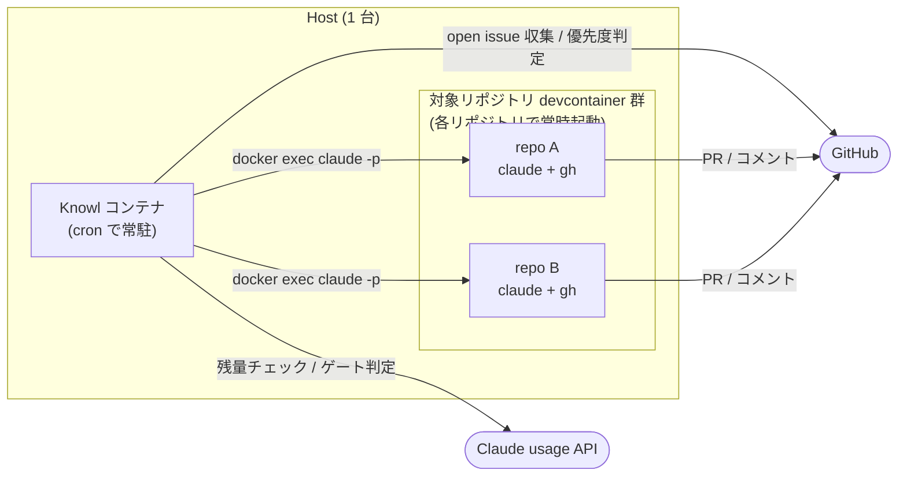

# Knowl

複数のリポジトリの GitHub issue を、Claude Code の使用枠が余っている時間帯に自律で消化する小さなオーケストレータ。Max plan の OAuth トークンを流用するので、追加の API キーや課金は不要。

cron 周期ごとに「Claude の usage 残量を確認 → 余裕があれば全リポの open issue から最優先 1 件を選択 → 対応する devcontainer 内で `claude -p` を発火」を回す。寝てる間にラベル付き issue が消化されていくのが想定運用。

## 前提

- Claude Max plan (usage API と OAuth トークンを使う)
- Docker / Docker Compose
- 対象リポジトリそれぞれが docker / devcontainer でビルド済みで、内部に `claude` と `gh` が認証済で入っていること (詳細は[対象リポジトリ container 側のセットアップ](#対象リポジトリ-container-側のセットアップ))
- GitHub Personal Access Token (`GH_TOKEN`) — Knowl が issue / PR 操作に使う

## 構成イメージ



Knowl コンテナ自身は GitHub と Claude usage API を見るだけで、実装作業は各 devcontainer 側の `claude -p` に委譲する。credentials の中継は一切しない。

## クイックスタート

最小構成で動かす手順。Slack 通知や slash command は[オプション機能](#オプション機能)で後から足せる。

1. **設定ファイルを用意**

   ```bash
   cp knowl.example.yaml knowl.yaml
   $EDITOR knowl.yaml   # repositories に対象リポジトリと container 名を書く
   ```

   `knowl.example.yaml` が設定の公式リファレンス。全項目はそこを参照。

2. **ホスト側で Claude Code をインストール & ログイン**

   [Claude Code 公式ドキュメント](https://docs.claude.com/en/docs/claude-code) の手順でインストールし、Max plan のアカウントでログインする。`~/.claude/.credentials.json` が生成されていれば OK。

3. **`.env` に GitHub トークンを置く**

   ```bash
   cat > .env <<'EOF'
   GH_TOKEN="ghp_..."
   EOF
   ```

4. **起動**

   ```bash
   make start
   ```

   起動直後に 1 サイクル動く。以降は `cron_interval_minutes` (デフォルト 60 分) ごとに自動実行。ゲート判定で余裕がなければ no-op で次回まで待機する。

ログは `make logs`、設定の妥当性確認は `uv run knowl check-config --config knowl.yaml`。

## 対象リポジトリ container 側のセットアップ

Knowl は `docker exec <target> claude -p ...` で対象リポジトリ container 内の Claude を起動するだけで、credentials の中継は一切しない。対象 container 側で以下が必要:

- Claude Code がインストール済 + 認証済 (`~/.claude/.credentials.json` 相当が存在)
- `gh` がインストール済 + 認証済

Knowl は `claude -p` に既定で `--dangerously-skip-permissions` を付ける。これは「対象 container はサンドボックスである」前提に基づく。container の隔離設計が不十分な場合は、自前ラッパで `--allowed-tools` 制限などに置き換えること。

タスクタイプ (実装 / 調査) は issue に専用ラベルを付けると Claude を介さず決定する。`knowl-implementation` / `knowl-investigation` のどちらか一方を付けるとそのタイプで実行される。両方付いている / どちらも無い場合は Claude 判定にフォールバックする。各リポジトリで `gh label create knowl-implementation` / `gh label create knowl-investigation` で作成しておく。

## 使い方

Makefile 経由が標準。中身は `docker compose -f docker/docker-compose.yml ...` の薄いラッパなので、素の docker compose を直接叩いても等価。`make help` でターゲット一覧。

| target | 役割 |
| --- | --- |
| `make start` | 監視開始 (build + 常駐コンテナ起動)。起動直後に 1 サイクル動く |
| `make deploy` | 稼働中コンテナの差し替え (rebuild + 再起動。即時 1 サイクルはスキップ) |
| `make stop` | 監視終了 |
| `make run-once` | 1 サイクルだけ ephemeral コンテナで実行 |
| `make logs` | ログ確認 |

## オプション機能

### Slack 通知 / slash command `/knowl`

サマリ通知 / limit アラート、および `/knowl` での ad-hoc 起動はどちらも 1 個の Slack App で賄える。使う機能に応じて手順を取捨選択する。

1. [api.slack.com/apps](https://api.slack.com/apps) で新しい App を作成
2. **OAuth & Permissions** → Bot Token Scopes に必要な scope を追加
   - `chat:write` — サマリ通知 / limit アラートに必須
   - `commands` — slash command `/knowl` も使う場合に追加
3. workspace にインストールして Bot User OAuth Token (`xoxb-...`) を取得 → `.env` の `SLACK_BOT_TOKEN`
4. 通知先チャンネルに bot を invite し、`SLACK_CHANNEL` か `knowl.yaml` の `slack.channel` で指定
5. slash command `/knowl` も使う場合は追加で:
   - **Socket Mode** を有効化し、App-Level Token (`xapp-...`) を発行 (scope: `connections:write`) → `.env` の `SLACK_APP_TOKEN`
   - **Slash Commands** で `/knowl` を登録 (Request URL は不要)
6. `make deploy` で反映 (`SLACK_BOT_TOKEN` 単体なら通知のみ、`SLACK_APP_TOKEN` も揃うと bot が起動する)

`.env` で揃える環境変数:

```bash
SLACK_BOT_TOKEN="xoxb-..."
SLACK_CHANNEL="#通知したいチャンネル"
SLACK_APP_TOKEN="xapp-..."   # slash command を使う場合のみ
```

bot は単一ユーザ運用を前提に allowed_users チェックは持たない。workspace 自体を 1 人用に保つ必要がある。

`/knowl` の使い方は cron 周期を待たずに「今これやって」を投げたいとき用:

```
/knowl run <repo> <自由記述の指示>
```

例:

- `/knowl run knowl Slack bot 機能のテストを追加`
- `/knowl run owner/some-repo README に使用例セクション追加`

`<repo>` を `name` のみで書いた場合、bot は `gh api user --jq .login` で取得したログインユーザ名で `owner/name` に補完する。受け付けた指示はその場で対象 repo に seed issue として起票され、通常の実装パイプラインに流れて PR まで作る。

### OAuth トークンの自動 refresh (host 側 keepalive)

Claude Code の OAuth access token は概ね 8h で expire する。夜間も走らせる前提だと寝てる間に切れて翌朝まで no-op を続けるので、host 側の cron でトークンを保たせる仕組みを別途用意している。

```bash
make keepalive-start    # crontab に登録 (デフォルト */30 * * * *)
make keepalive-status   # 登録状況の確認
make keepalive-now      # 即時実行 (cron を待たない動作確認)
make keepalive-logs     # .logs/keepalive.log を tail
make keepalive-stop     # 登録解除
```

- refresh が走るのは閾値割れ時だけなので、API 消費は 1 日数回 (~$0.1 オーダ)。
- 周期や閾値は上書き可: `make keepalive-start KEEPALIVE_CRON='*/15 * * * *'`、`scripts/keepalive.sh --threshold-hours 1`。
- 動作ログは `.logs/keepalive.log`。

## 設定スキーマ (抜粋)

全項目は `knowl.example.yaml` を参照。

```yaml
model: claude-opus-4-7        # 既定。Claude モデル ID。
cron_interval_minutes: 60     # cron 周期 (分)。
thresholds:
  session_remaining_pct: 30   # 5h 枠の最低残量 (%)
  weekly_remaining_pct: 10    # 週次枠の最低残量 (%)
slack:
  channel: "#knowl"           # SLACK_CHANNEL 環境変数で上書き可
templates:
  implementation: templates/implementation.md
  investigation: templates/investigation.md
repositories:
  - name: owner/repo
    container:
      kind: docker            # docker | devcontainer (どちらも docker exec で扱う)
      name: container-name
      workdir: /workspace
      # user: vscode          # docker exec --user に渡す (任意)。
      #                       # devcontainer の remoteUser で claude を入れている場合等に指定。
      # exec_prefix: ["direnv", "exec", "."]
      #                       # argv の前に prepend する任意のラッパ (任意)。
      #                       # docker exec 非対話で direnv 等を発火させたい時に使う。
```

## 内部動作

cron 周期ごとに 1 サイクル実行する。各ステップの実装モジュールは以下:

| No | 内容 | 実装 |
| --- | --- | --- |
| 1 | リポジトリ登録 / container 自動起動 | `knowl.config`, `knowl.container` |
| 2 | Claude usage API 取得 (5h / 週次) | `knowl.usage` |
| 3 | 起動ゲート判定 (デフォルト 30% / 10%) | `knowl.gate` |
| 4 | 全リポ open issue 収集 + Claude 優先度判定 | `knowl.github_client`, `knowl.prioritize` |
| 5 | 実装タスク → PR / 自動 merge (`knowl-implementation` ラベルで明示可) | `templates/implementation.md`, `knowl.tasks` |
| 6 | 調査タスク → issue コメント (`knowl-investigation` ラベルで明示可) | `templates/investigation.md`, `knowl.tasks` |
| 7 | 後続タスクの起票 | テンプレ内手順 + `knowl.tasks` |
| 8 | Slack サマリ通知 / limit アラート | `knowl.slack` |

### Knowl 自身を Knowl で回す場合の伝播

Knowl 自身のリポジトリで PR がオートマージされた場合の伝播は次の 2 経路:

- ソース・テンプレート変更: 次回実行から自動適用。
- 依存追加 / entry-point 追加など `.venv` 再生成が必要な変更: `make deploy` による image の rebuild + 再起動が必要。

## ローカル開発

```bash
uv sync
uv run ruff check
uv run mypy
uv run pytest
uv run knowl check-config --config knowl.example.yaml
```

## 開発者向けドキュメント

開発者向け補足は `docs/status.html` 参照。

## ライセンス

Apache License 2.0. 詳細は `LICENSE` を参照。
